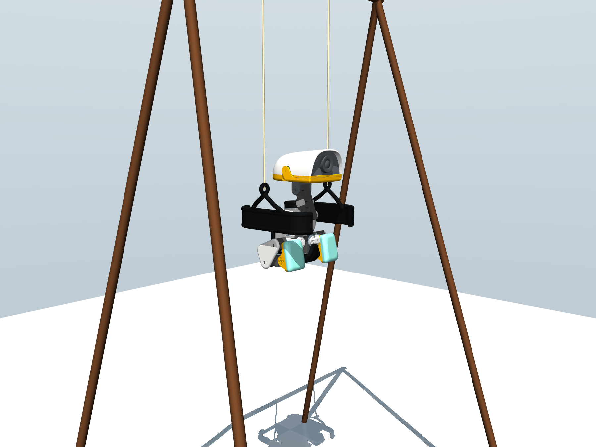

# Self-pumped swing

MicroDuck starts motionless at the bottom of a 380 mm two-cord swing and uses
only its articulated head and legs to build amplitude. There is no phase clock,
scripted impulse, prescribed trajectory, or privileged swing angle in the
61-dimensional actor observation. Exact string/seat geometry is critic- and
evaluation-only.



The representative rollout is
[`media/alpha050_seed27.mp4`](media/alpha050_seed27.mp4). It is silent, uses a
fixed camera, includes physically cast shadows, and displays the running
maximum full-span angle.

## Selected policy

`checkpoints/alpha050.pt` is the selected physically credible frontier. It is
an exact 0.50 interpolation of every row in the final actor layer between
`frontier_source_3500.pt` and `planar_target_3600.pt`; all other actor tensors
are bitwise identical. The endpoint checkpoints and strict interpolation
utility are included so this selection step is reproducible.

| Metric | Result |
|---|---:|
| Randomized evaluation | 100 seeds × 36 s |
| Strict full-horizon passes | 71/100 |
| Geometry-debt-free passes | 73/100 |
| Median peak-to-peak span | 163.03° |
| Median final-six half-cycle span | 161.09° |
| Best strict rollout | seed 27, 173.20° |
| Seed-27 cord envelope | 370.38–392.02 mm |
| Seed-27 maximum lateral displacement | 10.35 mm |
| Seed-27 maximum attachment-alignment penalty | 0.02037 |

The full sampled seed-27 audit is in `eval/seed27_full.json`; the compact
aggregate is in `eval/summary.json`. A later 60-second replay reached 180.20°
only after leaving the exact geometry envelope, so that number is rejected.

## Install and verify

```bash
uv sync
uv run --with pytest pytest tests/test_swing_cfg.py
```

Run a deterministic physical audit:

```bash
uv run python scripts/evaluate_swing_checkpoint.py \
  experiments/swing/checkpoints/alpha050.pt \
  --output /tmp/swing-seed27.json \
  --device cpu \
  --duration 36 \
  --seed 27
```

Export the selected policy with its observation normalizer baked into ONNX:

```bash
uv run python scripts/export.py Mjlab-SwingPump-MicroDuck \
  --checkpoint-file experiments/swing/checkpoints/alpha050.pt \
  --onnx-file /tmp/microduck-swing.onnx \
  --device cpu
```

The exporter also bakes the training-time `[-1, 1]` action clamp into the graph.
Verify checkpoint-versus-ONNX actions along the complete seed-27 rollout:

```bash
uv run python scripts/verify_swing_onnx_parity.py \
  experiments/swing/checkpoints/alpha050.pt \
  /tmp/microduck-swing.onnx \
  --device cpu --duration 36 --seed 27
```

Do not hand-convert the PyTorch checkpoint: both the actor's observation
normalizer and its training-time action clamp must be embedded in the graph.
The official controller also needs the swing-specific still-frame IMU cue,
0.7 action scale, and unfiltered target path. A tested Rust reference adapter
and exact integration contract are in
[`../../integrations/pollen-microduck`](../../integrations/pollen-microduck/README.md).
The verified ONNX and its model card are hosted
on Hugging Face at
[`HannesVonEssen/microduck-swing`](https://huggingface.co/HannesVonEssen/microduck-swing)
rather than duplicated in this Git repository.

## Train from scratch

Always run a small smoke test before a long job:

```bash
uv run train Mjlab-SwingPump-MicroDuck \
  --env.scene.num-envs 64 \
  --agent.max-iterations 5

uv run train Mjlab-SwingPump-MicroDuck \
  --env.scene.num-envs 4096
```

The default task is the randomized sim-to-real-oriented configuration. The
selected policy was developed through staged physical-constraint training and
low-learning-rate final-layer correction; see `TRAINING.md` for the selection
recipe and the limits of exact reproduction from stochastic PPO.

The Hugging Face release also contains the selected `checkpoint.pt` and exact
resume instructions. The public training lineage ends at this video policy;
later directional-release, intentional-fall, and full-loop experiments are not
part of this release.

## What is randomized

The task inherits MicroDuck's actuator/sensor randomization and adds the swing
mechanism explicitly. The relevant envelope includes:

- BAM XL330 actuator dynamics;
- battery voltage and load-dependent voltage sag;
- control delay;
- friction, damping, and actuator-gain variation;
- encoder/IMU noise and small mounting variation;
- robot inertial variation inherited from the MicroDuck base task;
- two independent elastic, tension-only cords.

The default is not the nominal-actuator mechanism-limit mode. Environment
variable switches intended for audits are documented in the source and should
not be enabled accidentally when claiming randomized performance.

## Physical validity gates

Model selection required all of the following through the rollout, not just a
large angle:

- bounded lateral displacement and lateral velocity;
- bounded roll/yaw kinetics and attachment misalignment;
- neither cord deeply slack nor beyond its extension envelope;
- no reset, NaN, or nonphysical geometry debt;
- realistic BAM voltage/current/torque diagnostics.

This is still simulation evidence, not a hardware guarantee. Seat padding,
strap contact, cord knots, frame compliance, and collision proxies need
hardware calibration before deployment.
