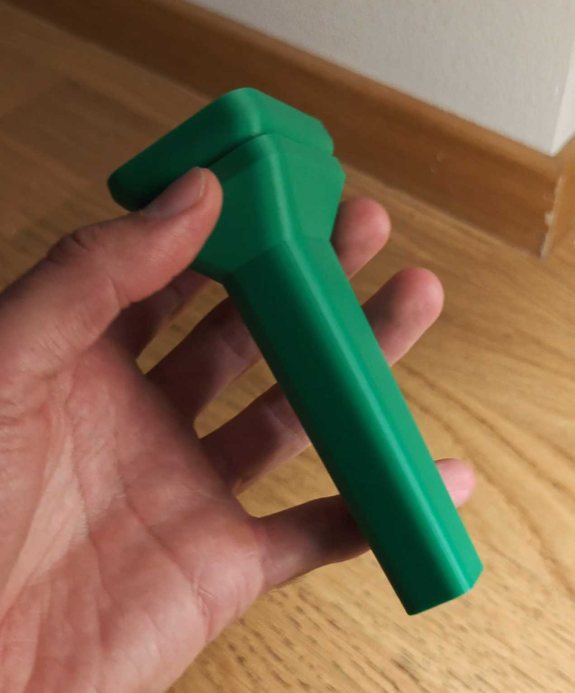
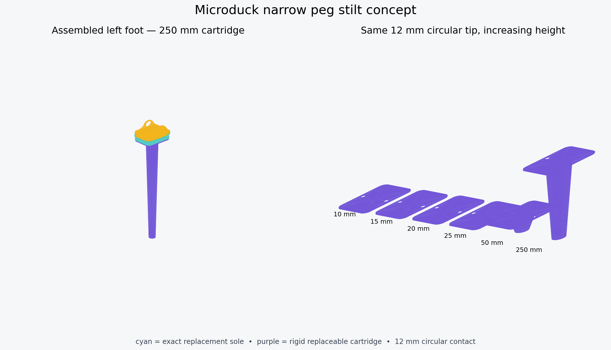
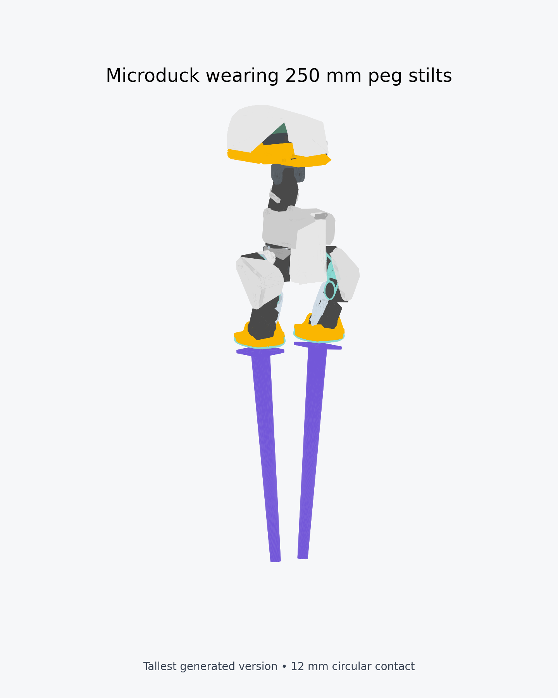
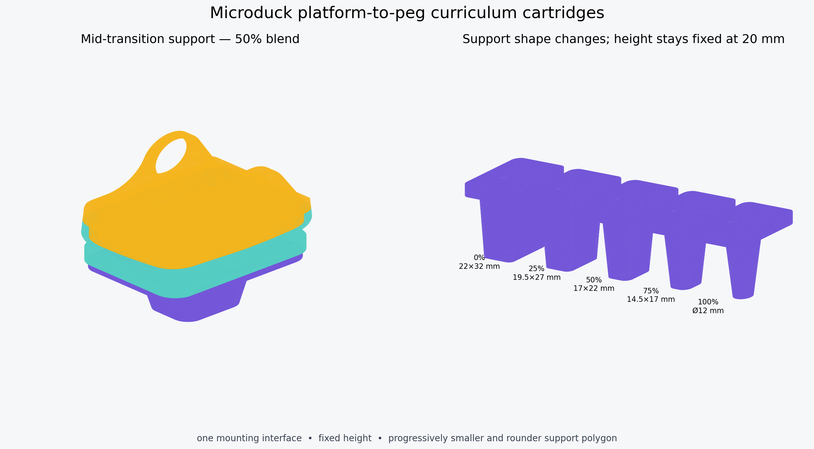

# Microduck modular stilts — prototype v0.1

This design leaves Microduck itself unmodified. It turns the existing removable
sole into a replaceable carrier with two captive M3 nuts, then bolts different
height cartridges to that carrier.

<table>
  <tr>
    <td align="center"><br><sub>Front</sub></td>
    <td align="center"><br><sub>Three-quarter</sub></td>
    <td align="center"><br><sub>Side</sub></td>
    <td align="center"><br><sub>3D-printed prototype</sub></td>
  </tr>
</table>

Recreate this gallery with
`MUJOCO_GL=egl uv run python scripts/render_hardware_gallery.py`.

## What is parametric

`generate_stilts.py` generates both exact-fit replacement soles and the
cartridges. The supplied set keeps a 22 × 32 mm contact footprint while raising
the duck by 0.5, 1, 1.5, and 2 cm. Keeping footprint constant makes height the
only changed variable during the first curriculum.

The narrow-peg family is separately parameterized. Its supplied set is 1, 1.5,
2, 2.5, 5, and 25 cm tall with a 12 mm circular contact. The peg widens to a
22 mm root under the mounting flange to reduce bending stress. The 25 cm
version is deliberately outlandish and exists as a simulation/visualization
target, not as a printable hardware recommendation.

The transition family holds height at 2 cm and morphs support shape through
0%, 25%, 50%, 75%, and 100% blends. At 0% it matches the 22 × 32 mm rounded
platform; at 100% it matches the 12 mm circular peg. Tip size, corner radius,
and root shape all interpolate together.

```bash
uv run hardware/stilts/generate_stilts.py
uv run hardware/stilts/generate_stilts.py --heights-cm .5 .8 1.2 1.6 2
uv run hardware/stilts/generate_stilts.py --heights-cm 1.5 --tip-width 14 --tip-length 22
uv run hardware/stilts/generate_stilts.py --peg-heights-cm 1 2 5 25 --peg-diameter 12
uv run hardware/stilts/generate_stilts.py --peg-heights-cm 2 3 --peg-diameter 10 --peg-root-diameter 20
uv run hardware/stilts/generate_stilts.py --transition-height-cm 1.5 --transition-blends 0 .2 .4 .6 .8 1
uv run hardware/stilts/generate_stilts.py --direct-heights-cm 10 15 20 25 50 100 140 200 --direct-blend .5
```

The generator uses the checked-in `sole_left.stl` and `sole_right.stl` as its
exact attachment surfaces. It adds rather than approximates that geometry.

The simulation mass law is `12 g + 1 g/cm` per stilt. At 10 cm this is 22 g
per stilt (44 g per pair), while the prototype slicer estimate is 58 g per
pair, approximately 29 g per stilt. The released actor passed an initial
64-environment simulation check at the heavier value; see the
[`10 cm printed-mass audit`](../../experiments/stilts/README.md#10-cm-printed-mass-audit).
That check is not a substitute for mass-randomized training or hardware
validation.

## Released policy geometry

These are the exact blend-0.50 fused replacement sole-and-stilt geometries
paired with the released policies. Each height includes separate left/right
meshes and a convenience pair file. STL units are millimetres.

| Height | Left | Right | Pair | Policy |
|---:|---|---|---|---|
| 10 cm | [STL](generated/release/direct_replacement_left_b0p50_h10p0cm.stl) | [STL](generated/release/direct_replacement_right_b0p50_h10p0cm.stl) | [STL](generated/release/direct_replacement_pair_b0p50_h10p0cm.stl) | [ONNX](https://huggingface.co/HannesVonEssen/microduck-stilts/tree/main/10cm) |
| 15 cm | [STL](generated/release/direct_replacement_left_b0p50_h15p0cm.stl) | [STL](generated/release/direct_replacement_right_b0p50_h15p0cm.stl) | [STL](generated/release/direct_replacement_pair_b0p50_h15p0cm.stl) | [ONNX](https://huggingface.co/HannesVonEssen/microduck-stilts/tree/main/15cm) |
| 20 cm | [STL](generated/release/direct_replacement_left_b0p50_h20p0cm.stl) | [STL](generated/release/direct_replacement_right_b0p50_h20p0cm.stl) | [STL](generated/release/direct_replacement_pair_b0p50_h20p0cm.stl) | [ONNX](https://huggingface.co/HannesVonEssen/microduck-stilts/tree/main/20cm) |
| 25 cm | [STL](generated/release/direct_replacement_left_b0p50_h25p0cm.stl) | [STL](generated/release/direct_replacement_right_b0p50_h25p0cm.stl) | [STL](generated/release/direct_replacement_pair_b0p50_h25p0cm.stl) | [ONNX](https://huggingface.co/HannesVonEssen/microduck-stilts/tree/main/25cm) |
| 50 cm | [STL](generated/release/direct_replacement_left_b0p50_h50p0cm.stl) | [STL](generated/release/direct_replacement_right_b0p50_h50p0cm.stl) | [STL](generated/release/direct_replacement_pair_b0p50_h50p0cm.stl) | [ONNX](https://huggingface.co/HannesVonEssen/microduck-stilts/tree/main/50cm) |
| 1.0 m | [STL](generated/release/direct_replacement_left_b0p50_h100p0cm.stl) | [STL](generated/release/direct_replacement_right_b0p50_h100p0cm.stl) | [STL](generated/release/direct_replacement_pair_b0p50_h100p0cm.stl) | [ONNX](https://huggingface.co/HannesVonEssen/microduck-stilts/tree/main/100cm) |
| 1.4 m | [STL](generated/release/direct_replacement_left_b0p50_h140p0cm.stl) | [STL](generated/release/direct_replacement_right_b0p50_h140p0cm.stl) | [STL](generated/release/direct_replacement_pair_b0p50_h140p0cm.stl) | [ONNX](https://huggingface.co/HannesVonEssen/microduck-stilts/tree/main/140cm) |
| 2.0 m | [STL](generated/release/direct_replacement_left_b0p50_h200p0cm.stl) | [STL](generated/release/direct_replacement_right_b0p50_h200p0cm.stl) | [STL](generated/release/direct_replacement_pair_b0p50_h200p0cm.stl) | [ONNX](https://huggingface.co/HannesVonEssen/microduck-stilts/tree/main/200cm) |

The 50 cm–2.0 m meshes are simulation/reference geometry, not monolithic
print recommendations. The 3.0 m demonstration was a zero-shot failure of
the unchanged 2.0 m policy, so there is intentionally no separate 3.0 m
policy release.







## Parts for one robot

- 1 × `carrier_left.stl`, printed in TPU 95A
- 1 × `carrier_right.stl`, printed in TPU 95A
- 2 × matching height pod, printed in PETG, PA12, or tough PLA+
- 4 × M3 DIN 934 nuts
- 4 × M3 × 6 mm low-profile socket screws
- 2 × 1–2 mm rubber or TPU tread pads, bonded to the pod tips

For the 40 cm blend-0.50 simulation milestone, the experimental
`generated/direct_replacement_pair_b0p50_h40p0cm.stl` contains both
side-specific replacement soles fused directly to their stilts. It needs no
cartridge screws or captive nuts. This extreme-height file is a geometry and
simulation artifact, not a structurally approved printable hardware design.

The corresponding 10 cm support-free experiment is
`generated/direct_replacement_pair_b0p50_h10p0cm_supportfree45deg.stl`.
Its flat stem-to-sole shelves are replaced by all-around chamfers whose measured
worst overhang is 44.5 degrees when printed tip-down and upright. The exact
robot-foot socket geometry above the chamfer is unchanged.

The nut pockets open inside the replacement sole. Insert the nuts, fit the foot
into the sole, and the foot traps the nuts. The cartridge screws enter from its
recessed underside. Use low-strength threadlocker only after fit checks.

## Print and fit check

1. Print one carrier at 0.20 mm layers, sole opening upward. Use 4 perimeters
   and 35–50% infill. Do not use supports inside the foot cavity.
2. Confirm the unpowered foot seats completely and can still be removed by
   hand. TPU varies materially between printers; stop if the ankle or bearing
   is preloaded.
3. Fit one 0.5 cm cartridge. The two M3 heads must sit fully below the cartridge
   recesses and the pod must have no detectable rocking.
4. Load each stationary foot vertically to at least 25 N, then laterally to
   10 N, before powering the robot. Inspect the TPU around both nuts.
5. First powered tests need a slack overhead tether, current limits, a soft
   floor, and no people in the fall envelope.

The strength figures above are prototype acceptance checks, not certified load
ratings. Print orientation, filament condition, and nut fit dominate the result.
For a peg cartridge, use at least 6 perimeters and 80–100% infill. Rotate it in
the slicer so the flat top of the mounting flange is on the build plate and the
peg points upward. A 2.5 cm peg already creates substantially more bending
leverage than the platform cartridge and should only be tested with a slack
overhead tether. Do not put the printed 5 cm version on hardware without a
separate structural review and a metal load path through the peg. The generated
25 cm version is not a viable monolithic polymer part: a hardware realization
would need an engineered metal or composite structure, redesigned joints and
mounting interface, and a fall-safety system.

## Optional bought rubber tip

`pod_m3_rubber_bumper_adapter.stl` accepts a central M3 heat-set insert and a
male M3 rubber vibration bobbin. An 8 mm diameter × 8 mm tall bobbin is a useful
later-stage narrow tip, not the first training foot. Examples in the right size
class include:

- [RS PRO 8 × 8 mm M3 male/female mount](https://uk.rs-online.com/web/p/anti-vibration-mounts/1264282)
- [MISUMI 8 × 8 mm M3 anti-vibration mount family](https://my.misumi-ec.com/pr/vona/free_download_misumi_economy_catalog/pdf/misumi_economy_anti_vibration_rubber_mounts_trims.pdf)
- [Essentra 10 × 10 mm M3 vibration mount](https://www.essentracomponents.com/en-gb/p/sandwich-stud-mounts/497721)

Measure the actual insert and bobbin stud before production printing. The
generated adapter uses a 4.2 mm pilot, which is common but not universal.

## Training geometry

Train height independently of footprint first: 0.5 → 1 → 1.5 → 2 cm with the
22 × 32 mm tip. Once 1.5 cm is reliable, randomize height by roughly ±0.2 cm and
friction/compliance. Only then shrink the tip toward 14 × 22 mm or substitute
the M3 rubber bobbin.

Treat the 12 mm circular peg as a separate advanced curriculum. Introduce its
1 cm version from a policy already reliable on the medium rectangular tip,
then progress 1 → 1.5 → 2 → 2.5 → 3.5 → 5 cm while keeping diameter fixed.
Treat 25 cm as a separate extreme experiment rather than the next ordinary
curriculum step; bridge the gap with additional intermediate heights if it is
ever trained. Use the transition cartridges to shrink the support polygon in
separate 0 → 25 → 50 → 75 → 100% steps. Do not combine height increases and
support reductions in the same curriculum transition.

In simulation the stilt must be the contacting geometry. Disable the old sole
collision against the floor, move foot-contact sensing to the pod tip, add pod
mass/inertia, and randomize tip friction, compliance, height, and small mounting
tilt. Do not merely lower the floor: that preserves the old support polygon and
trains the wrong balance problem.

## License

These 3D hardware design files are licensed
[CC BY-NC-SA 4.0](../../LICENSE-HARDWARE).
