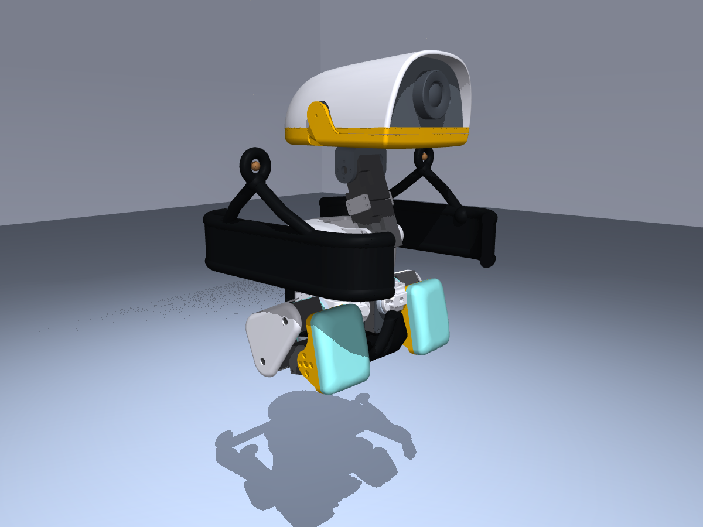

# Retained swing seat

Parametric, printable MicroDuck swing seat with a shallow floor pan, open leg
and neck corridors, two string eyelets, compliant battery-corner locating
pads, and a removable padded retention strap with buckle.

<table>
  <tr>
    <td></td>
    <td></td>
    <td></td>
  </tr>
</table>

## Files

- `source/generate_seat.py` — original parametric bucket-seat generator;
- `source/generate_retained_seat.py` — final retained-seat variant;
- `source/retention_system.py` — strap, buckle, and bumper geometry;
- `source/verify_*.py` — leg/head/pumping/retention clearance checks;
- `meshes/*_mm.stl` — millimetre-scale printable/CAD meshes;
- `../../src/mjlab_microduck/robot/microduck/assets/swing_*.stl` — metre-scale
  MuJoCo visual and convex collision meshes;
- `meshes/*clearance*.json` — saved clearance reports for the generated parts.

## Generate

```bash
python -m venv .venv-seat
.venv-seat/bin/pip install -r hardware/swing-seat/source/requirements.txt
cd hardware/swing-seat/source
../../../.venv-seat/bin/python verify_all.py
```

`verify_all.py` generates the base, padded, and retained seat variants before
running the complete retention and pumping-clearance checks. This ordering is
important because the clearance verifiers compare against the generated base
seat as well as the retained design. To run the release checks separately, use:

```bash
../../../.venv-seat/bin/python generate_seat.py
../../../.venv-seat/bin/python generate_padded_seat.py
../../../.venv-seat/bin/python generate_retained_seat.py
../../../.venv-seat/bin/python verify_retention_clearance.py
../../../.venv-seat/bin/python verify_pumping_clearance.py
```

`verify_locator_clearance.py` is retained as a design-development diagnostic
for the earlier padded-seat variant. The complete retained-seat check supersedes
it for the released design.

The generators use millimetres for printable meshes. The simulation copy is
scaled to metres and decomposed into convex collision hulls using
`scripts/generate_swing_seat_collision_hulls.py`.

Recreate the studio gallery from the checked-in simulation geometry:

```bash
MUJOCO_GL=egl uv run python scripts/render_hardware_gallery.py
```

## Design intent

The locating pads and strap resist sideways translation and yaw without
occupying the sagittal leg corridor used for pumping. The clearance tools
sample MicroDuck geometry through leg and head ranges with a conservative
margin. Their passing reports verify the modeled meshes, not every real print:
padding thickness, textile stretch, buckle placement, printer shrinkage, and
assembly tolerances must still be checked physically.

The retention system is intended to keep the robot seated during ordinary
pumping. It is not certified fall protection and should not be treated as the
sole safety tether.

## License

These 3D hardware design files are licensed
[CC BY-NC-SA 4.0](../../LICENSE-HARDWARE), following the hardware-file
convention in the upstream MicroDuck RL repository.
